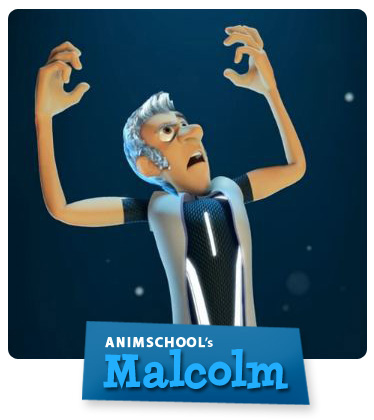

Title: Rigging en producción
Author: Cesar Saez
Tags: thoughts

# Rigging en producción.

Hola, mi nombre es César Sáez y me dedico a hacer rigs y desarrollar soluciones
relacionadas con rigging desde hace algunos años.

A lo largo de mi carrera he tenido la oportunidad de trabajar como rigger en
proyectos de distinta naturaleza, desde cortometrajes de animación, pasando por
anuncios publicitarios, series de televisión y películas de animación.  Pese a
que las condiciones de trabajo y requerimientos son diferentes en cada caso,
existe un patrón que se repite con respecto a lo que se considera un buen rig
de producción que me gustaría compartir en éste artículo.


## Necesidades de producción.

Cuando trabajamos en una producción tenemos la obligación de satisfacer
necesidades tales como:

* Necesidades del "cliente": comportamientos necesarios para manipular los
  rigs, rango de movimiento, deformaciones creíbles, retargeting/mocap,
  requerimientos de simulación/fx, etc.

* Necesidades de pipeline: convenciones necesarias para interactuar con otros
  departamentos, forma de salvar ficheros, serialización, etc.

* Necesidades propias: producir rigs de **calidad** de forma consistente en el
  menor tiempo posible.

Debido a que las necesidades del "cliente" están directamente relacionadas a la
naturaleza del proyecto y las necesidades de pipeline dependen del estudio, me
centraré en lo relacionado a la calidad.


## ¿Que entendemos por calidad?

Calidad es un concepto relativo, la norma [ISO
9000](https://es.wikipedia.org/wiki/Normas_ISO_9000) la define como:

> Calidad: grado en el que un conjunto de características inherentes cumple con
> los requisitos.

Por lo tanto para hablar de calidad debemos considerar los requisitos que nos
impone la naturaleza de la producción (en adición a los requisitos del cliente
y pipeline), y es aquí donde creo que no siempre prestamos la suficiente
atención.


## Requisitos de producción.

La producción nos plantea una serie de retos interesantes que de alguna forma
definen la diferencia entre un rig apto para producción y una demo técnica,
prototipo o proyecto personal.

En toda producción nos vemos enfrentados a lo siguiente:

* Debemos producir gran cantidad de rigs: probablemente +1 personaje/prop por
  proyecto.

* Larga duración: según el proyecto los rigs serán utilizados durante
  semanas/meses/años.

* Trabajo en equipo: equipos especializados, +1 rigger.

* Trabajo en paralelo: donde sea posible.

A partir de ésta realidad debemos definir ciertos estándares que nos ayuden a
"sobrevivir" bajo estas condiciones, una guía de estilo, de modo que todos
hablemos un idioma común y nos entendamos sin mayores inconvenientes.


## Convención de nombres.

Un rig está compuesto por muchísimos componentes y como consecuencia de ello es
necesario asignarles nombres descriptivos para entender la función de cada uno
de ellos.

Cuando trabajamos exclusivamente para nosotros mismos todo vale, pero cuando se
trabaja en equipo se hace necesario acordar y respetar una estructura común con
el fin de que nos entendamos, a esto se le llama convención de nombres.

Las convenciones de nombre no son nada nuevo, las usamos a diario cuando
consultamos la fecha (dd/mm/aaaa), escribimos una dirección de correo
electrónico (nombre@dominio) o miramos la hora (hh:mm:ss), es un concepto
universal que se usa para definir la notación con la que se describen los
componentes de nuestros rigs (cada estudio define su propia convención en
función de sus necesidades, no existe un estándar).


En adición a ello, hay que considerar que no siempre será un humano el que
interactuará con el rig, en muchos casos se crearán herramientas para ayudar al
animador en su día a día. Esto último implica que los nombres deben ser
consistentes entre los componentes del rig y lo más explícitos posible en honor
al principio [KISS](https://es.wikipedia.org/wiki/Principio_KISS).

### Ejemplos:

Con el fin de ilustrar como se aplica este concepto, analizaremos como están
nombrados los componentes de rigs disponibles online de forma gratuita.

Quisiera destacar que los rigs seleccionados están muy bien logrados a nivel
artístico y que cumplen perfectamente su función (ejercicios de animación), el
objetivo del análisis es hacer notar que un rig que funciona a nivel artístico
**no** es necesariamente válido para ser usado en producción.

#### [Stewart](http://www.animationmentor.com/free-maya-rig) (Animation Mentor)


Veamos un par de nombres para analizar el patrón:

    stw_lf_wrist_fk_ctrl
    stw_lf_arm_ik_ctrl
    stw_lf_indexBase_fk_ctrl
    stw_rt_wrist_fk_ctrl
    stw_rt_arm_ik_ctrl
    stw_rt_indexBase_fk_ctrl

    donde:
    * Personaje: stw (Stewart)
    * Lado:      lf, rt (left, right)
    * Nombre:    clavicle, wrist, arm, indexBase
    * Descr:     fk, ik
    * Tipo:      ctrl (animation control)


Perfecto! al parecer hemos encontrado un patrón consistente entre los controles
de animación del rig (y eventualmente entre todos sus componentes).

Éste patrón nos permitiría hacer cosas como identificar todos los controles de
animación `fk` buscando los nodos cuyo 4to y 5to campo correspondan a `fk` y
`ctrl` respectivamente... parece útil, verdad?

Lamentablemente no es el caso de Stewart :(

Si investigamos más a fondo encontraremos que el patrón no es consistente y los
componentes están nombrados de acuerdo a distintas estructuras.

Para un mayor análisis ejecutaremos el siguiente script (python):

```python
from collections import Counter
from maya import cmds


validate = lambda n: n.endswith("_ctrl") and cmds.nodeType(n) == "transform"
ctrls = [x for x in cmds.ls("*") if validate(x)]
counter = Counter([len(x.split("_")) for x in ctrls])

print "Nro de ctrls:", len(ctrls)
for x in counter.items():
    print "* {1:0>2} ctrls con {0} campos".format(*x)
```

Donde descubrimos:

    Nro de ctrls: 157
    * 06 ctrls con 3 campos
    * 22 ctrls con 4 campos
    * 50 ctrls con 5 campos
    * 39 ctrls con 6 campos
    * 04 ctrls con 7 campos
    * 36 ctrls con 8 campos


#### [Malcolm](http://www.animschool.com/DownloadOffer.aspx) (AnimSchool)



Mismo test, veamos un par de nombres con tal de descubrir el patrón:

    ctlCornerLf
    ctlCornerRt
    ctlThumb1Lf
    ctlThumb1Rt
    ctlThumb2Lf
    ctlThumb2Rt
    ctlThumb3Lf
    ctlThumb3Rt

    donde:
    * Tipo:   ctl (control de animacion)
    * Nombre: Corner, Thumb1, Thumb2, Thumb3
    * Lado:   Lf, Rt (Left, Right)


En éste caso la definición de las palabras clave (campos) esta definida por el
paso de minúsculas a mayúsculas (a éste tipo de patrón se le llama `mixed
case`).  Desafortunadamente si investigamos más a fondo encontramos nombres
como `ctlHeadBt|lipCornerTargetTpRt_NeutralPose` donde evidentemente la
convención no es consistente.

Al igual que en el caso anterior, ejecutaremos el siguiente script con tal de
analizar todos los nombres (python):

```python
from collections import Counter
from maya import cmds


def split_mixedcase(name):
    r, tag = list(), name[0]
    for ch in name[1:]:
        if ch == "_": continue
        if ch.islower(): tag += ch
        else:
            r.append(tag)
            tag = ch
    r.append(tag)
    return r

def split(name):
    r = list()
    for n in name.split("|"):
        r.extend(split_mixedcase(n))
    return r

validate = lambda n: n.startswith("ctl") and cmds.nodeType(n) == "transform"
ctrls = [x for x in cmds.ls("*") if validate(x)]
counter = Counter([len(split(x)) for x in ctrls])

print "Nro de ctrls:", len(ctrls)
for x in counter.items():
    print "* {1:0>3} ctrls con {0:0>2} campos".format(*x)
```

Donde descubrimos:

    Nro de ctrls: 294
    * 005 ctrls con 02 campos
    * 053 ctrls con 03 campos
    * 077 ctrls con 04 campos
    * 108 ctrls con 05 campos
    * 050 ctrls con 06 campos
    * 001 ctrls con 10 campos


#### [The Andy Rig](http://www.creativecrash.com/maya/downloads/character-rigs/c/the-andy-rig/description#tabs) (John Doublestein)


A ver que tal Andy, seleccionando un grupo de controles al azar podemos
observar que:

    rig_andy_spine_0FK3
    rig_andy_hip_l_Bendy
    rig_andy_hip_r_Bendy
    rig_andy_wrist_l_SW
    rig_andy_elbow_r_Bendy
    andy_arm_IK_Cntrl_r

    donde:
    * Categoría: rig, (?)
    * Personaje: andy
    * Nombre:    spine, hip, wrist, elbow, arm
    * Lado:      (?), l, r, (?)
    * Tipo:      FK, Bendy, SW, IK_Cntrl(?)


En Andy existe una "intención" de convención pero es áltamente inconsistente.
Al igual que en los casos anteriores ejecutaremos el siguiente script para
realizar un análisis en mayor profundidad.

```python
from collections import Counter
from maya import cmds


ctrls = cmds.ls(sl=True) # from selection
counter = Counter([len(x.split("_")) for x in ctrls])

print "Nro de ctrls:", len(ctrls)
for x in counter.items():
    print "* {1:0>2} ctrls con {0} campos".format(*x)
```

Donde descubrimos:

    Nro de ctrls: 78
    * 30 ctrls con 2 campos
    * 04 ctrls con 3 campos
    * 07 ctrls con 4 campos
    * 35 ctrls con 5 campos
    * 02 ctrls con 6 campos


## Convención de formas y colores.

La convención de nombres es una buena medida para que nos entendamos entre
riggers, pero que hay de los animadores?

Es importante mantener cierta consistencia estética entre los rigs de forma tal
que los animadores puedan usar nuestros rigs sin tener que leer un manual de
instrucciones para cada uno de ellos. Ésto se logra, entre otras cosas,
asociando la estética del control con las posibilidades de manipulación y
siendo consistente entre los rigs de un mismo proyecto.

Si hacemos un repaso de los rigs analizados en la sección anterior, podemos ver
que el número de controles de animación es considerable (157, 294, 78
respectivamente), lo que refuerza esta necesidad de "entrenar" a nuestros
animadores manteniendo una relación entre la estética y la función.

Personalmente soy partidario de asociar los colores a la posición (izquierda,
derecha, centro) y la forma a la manipulación (elementos puntiagudos para
rotación/FK, redondeados para translación/IK) pero cada cual elige su
convención en función de lo que crea más adecuado.

### Ejemplos:

Evaluemos nuevamente los rigs considerando la relación entre la estética y
funcionalidad de sus controles de animación.

#### [Stewart](http://www.animationmentor.com/free-maya-rig) (AnimationMentor)


Lorem ipsum dolor sit amet, consectetur adipiscing elit. Cras molestie pretium
mattis. Lorem ipsum dolor sit amet, consectetur adipiscing elit. Phasellus
auctor volutpat facilisis. Phasellus eu erat facilisis, porttitor elit sit
amet, consequat neque. Maecenas pretium, arcu at consectetur laoreet, nisl
metus porttitor eros, vitae porta nibh enim at nibh. Sed commodo tristique est.
Nulla sit amet orci vel ante ultricies finibus. Aliquam aliquam augue nisl, vel
maximus eros pellentesque id. Curabitur lacinia arcu urna, vitae porta dui
vehicula sed. Pellentesque eu ultricies lectus.


#### [Malcolm](http://www.animschool.com/DownloadOffer.aspx) (AnimSchool)


Lorem ipsum dolor sit amet, consectetur adipiscing elit. Cras molestie pretium
mattis. Lorem ipsum dolor sit amet, consectetur adipiscing elit. Phasellus
auctor volutpat facilisis. Phasellus eu erat facilisis, porttitor elit sit
amet, consequat neque. Maecenas pretium, arcu at consectetur laoreet, nisl
metus porttitor eros, vitae porta nibh enim at nibh. Sed commodo tristique est.
Nulla sit amet orci vel ante ultricies finibus. Aliquam aliquam augue nisl, vel
maximus eros pellentesque id. Curabitur lacinia arcu urna, vitae porta dui
vehicula sed. Pellentesque eu ultricies lectus.


#### [The Andy Rig](http://www.creativecrash.com/maya/downloads/character-rigs/c/the-andy-rig/description#tabs) (John Doublestein)


Lorem ipsum dolor sit amet, consectetur adipiscing elit. Cras molestie pretium
mattis. Lorem ipsum dolor sit amet, consectetur adipiscing elit. Phasellus
auctor volutpat facilisis. Phasellus eu erat facilisis, porttitor elit sit
amet, consequat neque. Maecenas pretium, arcu at consectetur laoreet, nisl
metus porttitor eros, vitae porta nibh enim at nibh. Sed commodo tristique est.
Nulla sit amet orci vel ante ultricies finibus. Aliquam aliquam augue nisl, vel
maximus eros pellentesque id. Curabitur lacinia arcu urna, vitae porta dui
vehicula sed. Pellentesque eu ultricies lectus.


## Uniformidad entre rigs.

He añadido éste punto porque, pese a que no lo podemos ejemplificar utlizando
rigs gratuitos, considero que es uno de los elementos más importante para
lograr sacar adelante una producción y al que lamentablemente no siempre se le
presta la suficiente atención.

La creación de un rig es tan sólo una parte del trabajo de un rigger en
producción, la otra parte consiste en dar soporte a otros departamentos que
utilizan los rigs durante la producción. Según la naturaleza de la producción,
un rig puede ser utilizado fácilmente por algo más de 1 año por lo que tocará
resolver todos los problemas que surjan durante ese año, asi como ampliar las
capacidades del rig para adaptarlo a las nuevas necesidades de animación.

Para facilitar tales tareas, es importante que los rigs compartan una
estructura común y los mismos criterios/soluciones de forma que cualquier
integrante del equipo de rigging sea capaz de intervenir un rig sin la
necesidad de realizar un estudio detallado caso a caso.

Otra ventaja al afrontar los rigs de ésta forma, es que se hace muchísimo más
sencillo aplicar patches por lotes (batch) a los rigs en producción (en caso de
encontrar un error de base que se repite en múltiples rigs).

## Conclusiones.

Lamentablemente la convención de nombres no es consistente en ninguno de los
rigs analizados (!).

Sospecho que ésto es así porque son rigs destinados a estudiantes de animación
donde el énfasis está en la estética y no hace falta dar mayor soporte. Otra
posibilidad es que sean realizados de forma manual o con la ayuda de scripts
genéricos que no contemplan una convención de nombres consistente.

### ¿Es grave?

Depende, en principio nombramos las cosas para describir su función, si cada
nombre sigue su propio esquema nos hacemos un flaco favor para cuando tengamos
que revisitar el rig durante la producción (soporte) y/o desarrollar
herramientas que interactúen con él (character picker, pickwalk, etc).

Personalmente me parece un poco triste que tras tantísimo trabajo para crear
rigs atractivos se descuide la forma en que están construidos, creo que como
comunidad debemos hacer un esfuerzo para subir los estándares de calidad y
comenzar a ser más rigurosos con nuestro trabajo.

Nuestro resultado final, a diferencia de otros departamentos, es el rig en si
mismo (una pieza de software) y creo que tenemos mucho que aprender de los
estándares y buenas prácticas que se vienen haciendo en el desarrollo de
software "tradicional" desde hace décadas.

### ¿Como combatir estas inconsistencias?

Lo primero es definir una convención de nombres que contemple los campos
suficientes para describir los datos relevantes en el nombre.

Es tentador elegir una convención con pocos campos de forma que no haga falta
escribir nombres demasiado largos, pero es una trampa considerando cuantas
veces escribirás el nombre en relación a cuantas veces lo leerás durante la
producción. Es todo una cuestión de balance.

Es conveniente además hacer un comprobación exhaustiva antes de publicar el
rig, en muchos casos el test de nombres estará contemplado dentro de las
herramientas del pipeline y no se podrá publicar hasta que esté corregido.

En el caso de producciones que no cuenten con estos recursos, o bien podemos
escribir un script interno/temporal que nos ayude o lo hacemos de forma manual
(hasta que aprendamos a escribir scripts ;-) ), pero no hay excusa para no
comprobar que todo funcione antes de hacer llegar nuestro trabajo al siguiente
departamento, es parte de la profesionalización de nuestra especialidad.

